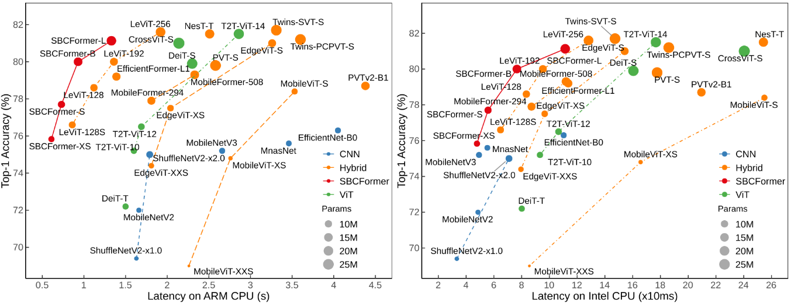

# SBCFormer
[SBCFormer: Lightweight Network Capable of Full-size ImageNet Classification at 1 FPS on Single Board Computers](https://arxiv.org/abs/2311.03747)

# Introduction

- This paper introduces a CNN-ViT hybrid network called SBCFormer, which achieves high accuracy and fast computation on such low-end CPUs.
- We compare our SBCFormers against a wide range of relevant and up-todate alternatives.
- SBCFormer uses the proposed hourglass attention computation to aggregate global information from the entire image while minimizing computational costs.
- SBCFormer achieves the highest trade-off between accuracy and speed on a Raspberry Pi 4 Model B with an ARM-Cortex A72 CPU.

<p align="center">
   <br>
  Models are trained on ImageNet-1K and measured the latency performance on ARM and Intel CPUs.
</p>

# Classification on ImageNet-1K
## Data Preparation
Download and extract ImageNet train and val images from http://image-net.org/. The training and validation data are expected to be in the `train` folder and `val` folder respectively:

```
/path/to/imagenet/
  train/
    class1/
      img1.jpeg
    class2/
      img2.jpeg
  val/
    class1/
      img3.jpeg
    class/2
      img4.jpeg
```
## Training
Training the SBCFormer_B on ImageNet with an 4-gpu server for 300 epochs:

```
OMP_NUM_THREADS=1 torchrun --nnodes 1 --nproc_per_node=4 --master_port 29502 main.py --lr 2.5e-4 --model "SBCFormer_B"  --resume "" --data-set "IMNET" --data-path "/path/to/imagenet" --input-size 224 --batch-size 1024  --epochs 300
```

## Evaluation


# Acknowledgement
This repository is built using the [timm](https://github.com/huggingface/pytorch-image-models) library and the [DeiT](https://github.com/facebookresearch/deit) repository.

# Citation
If our code or models help your work, please cite SBCFormer (WACV2024):

```BibTeX
@article{lu2024sbcformer,
  title={SBCFormer: Lightweight Network Capable of Full-size ImageNet Classification at 1 FPS on Single Board Computers},
  author={Xiangyong Lu, Masanori Suganuma, Takayuki Okatani},
  booktitle={Proceedings of the IEEE/CVF Winter Conference on Applications of Computer Vision (WACV)},
  year={2024}
}
```